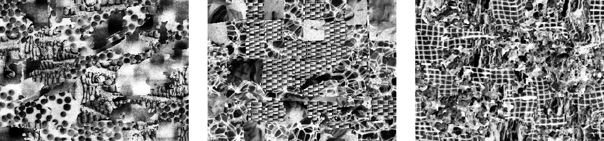
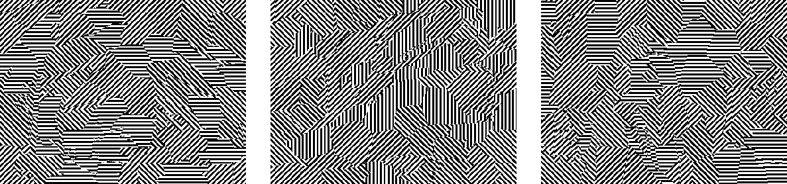

## CTD: Composite texture dataset used in the paper: [PDF](https://hal.archives-ouvertes.fr/hal-01510063/document)
```
@inproceedings{giraud2019texture,
  title={Texture-aware superpixel segmentation},
  author={Giraud, R{\'e}mi and Ta, Vinh-Thong and Papadakis, Nicolas and Berthoumieu, Yannick},
  booktitle={2019 IEEE International Conference on Image Processing (ICIP)},
  pages={1465--1469},
  year={2019}
}
```

### Overview

- mix-Brodatz: Natural composite texture dataset using images from the [Brodatz dataset](http://sipi.usc.edu/database/database.php?volume=textures) 



- mix-Stripes: Synthetic composite texture dataset combining lines with different orientations 




### Details

- Size: 11.6MB  
- Platform: Img are in .png format and ground truthes are given with both .png and .mat (matlab) formats.   
- Environment: No specific environment is needed to exploit the data. 


### License

(C) Rémi Giraud, 2020  
remi.giraud@u-bordeaux.fr  
[https://rgiraud.vvv.enseirb-matmeca.fr](https://rgiraud.vvv.enseirb-matmeca.fr)  
ENSEIRB-MATMECA (Bordeaux INP), Laboratory IMS


